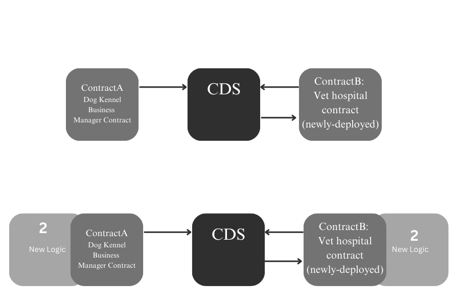

# Consolidated Dynamic Storage (CDS)

## Abstract
While Diamond Storage and Proxy-Delegate patterns offer time-tested upgradeability solutions, they introduce clear constraints: bloated contract structures, rigid storage alignment requirements, and complex integrations for new logic that become increasingly cumbersome as project scope expands.

Consolidated Dynamic Storage (CDS) introduces a flexible, gas-efficient system that supports post-deployment creation and extension of both mapped struct layouts and their corresponding segregated storage spaces, enabling seamless storage evolution through a unified, centralized layer shared by pure contracts.

CDS achieves this by combining two core features:

Extendable Structs: Struct members can be dynamically appended to existing mapped structures using a compact [bitCount(128), type(64), size(64)] format.

Modular Storage Spaces: Configurable, logically-separated namespaces that support dynamic mappings-of-structs and in-place extensions.
This architecture centralizes storage management, enabling seamless storage-level integration for new contracts. By eliminating slot collisions, streamlining upgrades, and enabling dynamic state transparency, CDS is ideal for evolving systems like DeFi protocols, DAOs, and modular frameworks requiring frequent upgrades.

